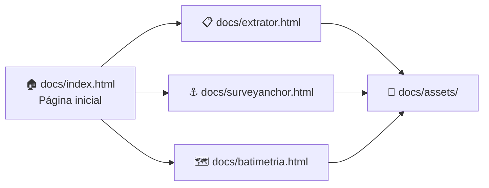
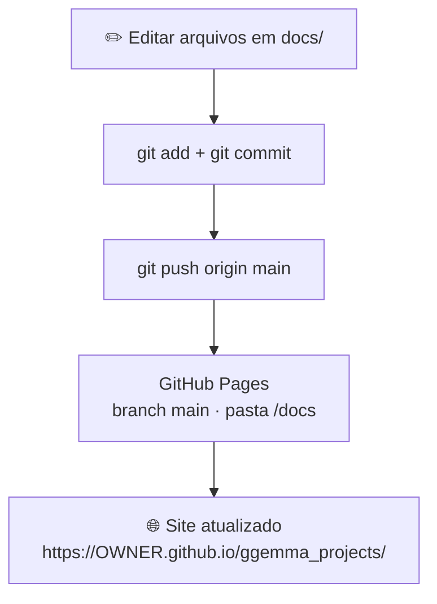

# 🌊 Catálogo de ferramentas — geofísica marítima

Bem-vindo(a)! Este repositório é a **vitrine online** de ferramentas Python que apoiam campanhas de **geofísica marítima** — inventário de dados, geolocalização batimétrica, conversão para GIS e geoprocessamento.

> 💡 **Não precisa saber programar** para usar a vitrine. Basta abrir o link no navegador e clicar nos cards das ferramentas.

> 🔒 **Privacidade:** a documentação versionada **não** inclui handles pessoais, e-mails, paths locais nem nomes de campanha. URLs usam o placeholder `<OWNER>` — copie a URL real do botão **Code** / Settings → Pages na sua conta.

---

## 📑 Sumário

- [🌐 Visite a vitrine online](#visite-a-vitrine-online)
- [🤔 O que é este projeto?](#o-que-e-este-projeto)
- [🧰 Ferramentas disponíveis](#ferramentas-disponiveis)
- [🔗 Sites de documentação (GitHub Pages)](#sites-de-documentacao)
- [👀 Ver no seu computador (opcional)](#ver-no-computador)
- [🛠️ Para quem mantém o site](#para-quem-mantem)
  - [Publicar no GitHub Pages](#publicar-pages)
  - [Adicionar uma nova ferramenta](#adicionar-ferramenta)
  - [Estrutura de pastas e fluxo](#estrutura-fluxo)
- [🔒 Privacidade](docs/privacidade.md)
- [❓ Dúvidas frequentes](#duvidas-frequentes)

---

<a id="visite-a-vitrine-online"></a>

## 🌐 Visite a vitrine online

**Link principal** (substitua `<OWNER>` pelo dono/organização do repositório):

👉 **`https://<OWNER>.github.io/ggemma_projects/`**

| Página | O que você encontra | Link (padrão) |
|--------|---------------------|---------------|
| 🏠 Página inicial | Cards de todas as ferramentas | `https://<OWNER>.github.io/ggemma_projects/` |
| 📋 extrator_info_files | Inventário de pasta/HD | `…/extrator.html` |
| ⚓ SurveyAnchor | Geolocalização batimétrica → KML | `…/surveyanchor.html` |
| 🗺️ batimetria_kml_shape | Planilha → mapa | `…/batimetria.html` |

Abra em qualquer navegador. **Não** é necessário instalar nada. A URL real aparece em **Settings → Pages** após o deploy.

---

<a id="o-que-e-este-projeto"></a>

## 🤔 O que é este projeto?

Este catálogo **apresenta** ferramentas de apoio à pesquisa e à operação em campanhas marítimas. **Não substitui** a documentação técnica completa de cada produto — pense nele como a “vitrine da loja”; o manual detalhado fica no site Pages de cada ferramenta.

| Você é… | A vitrine ajuda a… |
|---------|---------------------|
| 🎓 Estudante ou iniciante | Entender o propósito de cada ferramenta sem jargão excessivo |
| ⚙️ Equipe de processamento | Descobrir qual solução usar em cada etapa da campanha |
| 🔬 Pesquisador(a) | Divulgar o portfólio de forma organizada |
| 🛠️ Mantenedor do site | Publicar HTML estático via GitHub Pages |

---

<a id="ferramentas-disponiveis"></a>

## 🧰 Ferramentas disponíveis

| Ferramenta | Versão | Para que serve (em poucas palavras) | Saiba mais |
|------------|--------|-------------------------------------|------------|
| 📋 **extrator_info_files** | **v0.2.1** | Inventário de pasta/HD (tipos, GPS, estágio) + PDF/CSV/JSON + **organize** (pastas EN / ano) | [Vitrine](docs/extrator.html) |
| ⚓ **SurveyAnchor** | **v0.7.3** | Ancora batimetria de campo à localização geográfica — KML enxuto, SHP, catálogo e organize | [Vitrine](docs/surveyanchor.html) |
| 🗺️ **batimetria_kml_shape** | suite | Planilha/texto → KML ou shapefile (linguagem clara para leigos + Pages) | [Vitrine](docs/batimetria.html) |

### ✨ Novidades refletidas nesta vitrine (jul/2026)

| Ferramenta | O que há de novo (para leigo) |
|------------|-------------------------------|
| **extrator_info_files** | Relatórios PDF/CSV/JSON; lê GeoTIFF; comando **organize** cria pastas `bathymetry/`, `documents/`, `images/`…; guia de comandos no próprio repositório |
| **SurveyAnchor** | Comandos unificados (`export-kml`, `catalog`, `organize`…); site de docs no Pages |
| **batimetria_kml_shape** | Páginas amigáveis + explicação sem jargão |

Cada ferramenta tem uma página própria na vitrine com explicação, exemplos e orientações gerais de uso.

---

<a id="sites-de-documentacao"></a>

## 🔗 Sites de documentação (GitHub Pages)

Além desta vitrine, cada produto pode ter o próprio site de docs (sempre com `<OWNER>` — sem handle pessoal no Git):

| Projeto | Como publica | URL (padrão) | Para quem |
|---------|--------------|--------------|-----------|
| **ggemma_projects** (esta vitrine) | Branch `main` · pasta `/docs` | `https://<OWNER>.github.io/ggemma_projects/` | Visão geral / divulgação |
| **SurveyAnchor** | GitHub Actions (MkDocs) | `https://<OWNER>.github.io/SurveyAnchor/` | Manual técnico |
| **extrator_info_files** | Branch `main` · pasta `/docs` | `https://<OWNER>.github.io/extrator_info_files/` | Guia de comandos e instalação |

> Em repositório **privado**, o GitHub Pages pode exigir plano Pro/Team.

---

<a id="ver-no-computador"></a>

## 👀 Ver no seu computador (opcional)

Se você clonou este repositório e quer **pré-visualizar** as alterações **antes** de publicar:

| Opção | O que você faz | Quando usar |
|-------|----------------|-------------|
| **1 — Abrir o HTML** | Vá em `docs/` → dê duplo clique em `index.html` | Teste rápido |
| **2 — Servidor local** | Rode o comando abaixo e abra `http://localhost:8080` | Se a Opção 1 não carregar CSS/imagens |

```powershell
cd ggemma_projects\docs
python -m http.server 8080
```

| Passo | O que fazer |
|-------|-------------|
| Abrir no navegador | **http://localhost:8080** |
| Encerrar o servidor | `Ctrl+C` no terminal |

> Precisa ter [Python](https://www.python.org/downloads/) instalado só para a Opção 2. Para **só ver a vitrine online**, Python **não** é necessário.

---

<a id="para-quem-mantem"></a>

## 🛠️ Para quem mantém o site

Esta seção é para quem edita ou publica a vitrine no GitHub.

<a id="publicar-pages"></a>

### Publicar no GitHub Pages

| Passo | O que você faz | Por quê |
|:-----:|----------------|---------|
| 1 | Criar o repositório `ggemma_projects` no GitHub (se ainda não existir) | Onde o site vai morar |
| 2 | Enviar o conteúdo para `main` (`git add` → `commit` → `push`) | O Pages lê a branch |
| 3 | Em **Settings → Pages**: Source = branch · Branch = `main` · Folder = `/docs` | Liga o site |
| 4 | Esperar alguns minutos | O GitHub gera a URL |

```powershell
git add .
git commit -m "Atualiza vitrine"
git push origin main
```

URL final: **`https://<OWNER>.github.io/ggemma_projects/`**

O arquivo `docs/.nojekyll` evita que o GitHub Pages processe o site com Jekyll e quebre caminhos ou assets.

**Checklist de privacidade antes do push** (detalhes: [`docs/privacidade.md`](docs/privacidade.md))

| Conferir | OK? |
|----------|-----|
| Sem e-mails, handles pessoais ou `C:\Users\…` / `Y:\…` nos HTML/SVG | ☐ |
| Sem nomes de campanha / cliente / rota / laboratório | ☐ |
| Links de Pages usam `<OWNER>` ou caminhos relativos (`extrator.html`) | ☐ |
| Transcripts `cursor_*.md` e `scripts/` estão no `.gitignore` | ☐ |

<a id="adicionar-ferramenta"></a>

### Adicionar uma nova ferramenta

| Passo | O que fazer | Arquivo |
|:-----:|-------------|---------|
| 1 | Criar a página HTML da ferramenta (mesmo estilo das existentes) | `docs/<nome>.html` |
| 2 | Incluir um card na página inicial | `docs/index.html` |
| 3 | Atualizar a tabela deste README | [Ferramentas disponíveis](#ferramentas-disponiveis) |
| 4 | Commit + push | O site online atualiza em alguns minutos |

<a id="estrutura-fluxo"></a>

### Estrutura de pastas e fluxo do projeto

Este repositório é **leve de propósito**: o site público vive **somente** em `docs/`. O README fica na raiz para quem visita o repositório no GitHub; scripts de manutenção ficam **apenas no seu computador** (não são enviados ao GitHub).

#### 🔄 Como o visitante percorre o site



| Passo do visitante | O que acontece |
|--------------------|----------------|
| 1 | Entra pela **página inicial** (`index.html`) e vê os cards |
| 2 | Clica em um card → **página dedicada** da ferramenta |
| 3 | Estilos e imagens vêm da pasta **`assets/`** |

#### 📂 Árvore de pastas (visão geral)

```text
📁 ggemma_projects/
│
├── 📄 README.md                      ← este arquivo (GitHub; não é o site Pages)
├── 📄 .gitignore                     ← bloqueia transcripts, scripts, segredos
│
└── 📁 docs/                          ← 🌐 ÚNICA PASTA DO SITE ONLINE
    ├── 📄 .nojekyll
    ├── 📄 index.html
    ├── 📄 extrator.html
    ├── 📄 surveyanchor.html
    ├── 📄 batimetria.html
    ├── 📄 privacidade.md
    └── 📁 assets/
        ├── 📄 style.css
        └── 📄 extrator_demo_tabela.svg

scripts/                              ← 🔧 só na sua máquina (ignorado pelo Git)
```

#### 🗺️ O que editar, dependendo do seu objetivo

| Eu quero… | Onde mexer |
|-----------|------------|
| Mudar textos ou cards da vitrine | `docs/index.html` |
| Atualizar a página de uma ferramenta | `docs/extrator.html`, `docs/surveyanchor.html` ou `docs/batimetria.html` |
| Ajustar cores / layout do site | `docs/assets/style.css` |
| Incluir uma **nova** ferramenta | criar `docs/<nome>.html` + card em `index.html` + linha no README |
| Publicar no ar | `git push` → Pages publica `docs/` |

#### ☁️ Fluxo de publicação (Git → site online)



> **Regra prática:** o site online usa **apenas** `docs/`. A pasta `scripts/` e arquivos de IDE ficam fora do Git (`.gitignore`).

---

<a id="duvidas-frequentes"></a>

## ❓ Dúvidas frequentes

| Pergunta | Resposta curta |
|----------|----------------|
| Preciso instalar Python para **só ver** a vitrine online? | **Não.** Basta abrir o link no navegador. |
| O site mostra o código das ferramentas? | A vitrine **descreve** as ferramentas. O código fica nos respectivos repositórios. |
| Qual a diferença entre esta vitrine e o Pages de cada produto? | Vitrine = **catálogo**. Pages do produto = **manual técnico**. |
| Atualizei um HTML e o site online não mudou? | Falta `git push`. O Pages republica em 2–10 minutos. |
| Posso compartilhar o link com pessoas de fora? | Sim, se Pages for público. As páginas **não** expõem dados de campanha nem dados pessoais. |

---

<p align="center">
  <strong>Catálogo de ferramentas</strong> · Geofísica marítima
</p>
