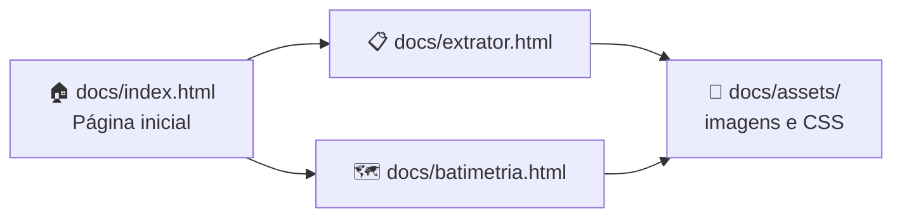
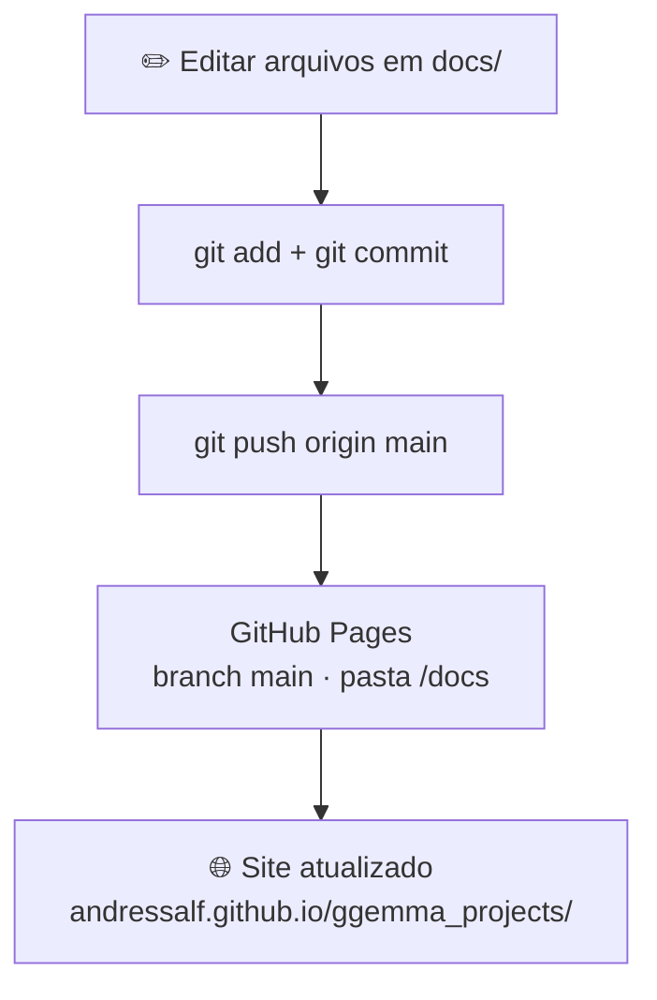

# 🌊 GGEMMA — Vitrine de Ferramentas

Bem-vindo(a)! Este repositório é a **vitrine online** do **laboratório GGEMMA**: um site simples onde você conhece, em linguagem clara, as ferramentas Python que apoiam campanhas de **geofísica marítima** — inventário de dados, conversão batimétrica e geoprocessamento.

> 💡 **Não precisa saber programar** para usar a vitrine. Basta abrir o link no navegador e clicar nos cards das ferramentas.

---

## 📑 Sumário

- [🌐 Visite a vitrine online](#-visite-a-vitrine-online)
- [🤔 O que é este projeto?](#-o-que-é-este-projeto)
- [🧰 Ferramentas disponíveis](#-ferramentas-disponíveis)
- [👀 Ver no seu computador (opcional)](#-ver-no-seu-computador-opcional)
- [🛠️ Para quem mantém o site](#️-para-quem-mantém-o-site)
  - [Publicar no GitHub Pages](#publicar-no-github-pages)
  - [Adicionar uma nova ferramenta](#adicionar-uma-nova-ferramenta)
  - [Estrutura de pastas e fluxo do projeto](#estrutura-de-pastas-e-fluxo-do-projeto)
- [❓ Dúvidas frequentes](#-dúvidas-frequentes)

---

## 🌐 Visite a vitrine online

**Link principal (compartilhe com quem quiser):**

👉 **https://andressalf.github.io/ggemma_projects/**

| Página | Link direto |
|--------|-------------|
| 🏠 Página inicial | [index](https://andressalf.github.io/ggemma_projects/) |
| 📋 extrator_info_files | [extrator.html](https://andressalf.github.io/ggemma_projects/extrator.html) |
| 🗺️ batimetria_kml_shape | [batimetria.html](https://andressalf.github.io/ggemma_projects/batimetria.html) |

Abra em qualquer navegador (Chrome, Edge, Firefox). Não é necessário instalar nada.

---

## 🤔 O que é este projeto?

O **GGEMMA** desenvolve ferramentas de apoio à pesquisa e à operação em campanhas marítimas. Esta vitrine **não substitui** a documentação técnica completa de cada ferramenta — ela **apresenta** o que cada uma faz, para quem serve e como ela se encaixa no fluxo de trabalho.

| Você é… | A vitrine ajuda a… |
|---------|---------------------|
| 🎓 Estudante ou iniciante | Entender o propósito de cada ferramenta sem jargão excessivo |
| ⚙️ Equipe de processamento | Descobrir qual solução usar em cada etapa da campanha |
| 🔬 Pesquisador(a) | Divulgar o que o laboratório oferece de forma organizada |

---

## 🧰 Ferramentas disponíveis

| Ferramenta | Para que serve (em poucas palavras) | Saiba mais |
|------------|-------------------------------------|------------|
| 📋 **extrator_info_files** | Triagem rápida de uma pasta de campanha — tipos de dado, coordenadas e estágio | [Página na vitrine](docs/extrator.html) · [Site online](https://andressalf.github.io/ggemma_projects/extrator.html) |
| 🗺️ **batimetria_kml_shape** | Conversão de levantamentos batimétricos para shapefiles prontos para GIS | [Página na vitrine](docs/batimetria.html) · [Site online](https://andressalf.github.io/ggemma_projects/batimetria.html) |

Cada ferramenta tem uma página própria com explicação, exemplos visuais e orientações gerais de uso.

---

## 👀 Ver no seu computador (opcional)

Se você clonou este repositório e quer **pré-visualizar** as alterações antes de publicar:

### Opção 1 — Abrir direto no navegador

1. Navegue até a pasta `docs/`
2. Dê duplo clique em `index.html`

> Alguns navegadores bloqueiam recursos locais. Se algo não carregar, use a Opção 2.

### Opção 2 — Servidor local simples (recomendado)

Com [Python](https://www.python.org/downloads/) instalado:

```powershell
cd ggemma_projects\docs
python -m http.server 8080
```

Depois abra no navegador: **http://localhost:8080**

Para encerrar o servidor: `Ctrl+C` no terminal.

---

## 🛠️ Para quem mantém o site

Esta seção é para quem edita ou publica a vitrine no GitHub.

### Publicar no GitHub Pages

1. Crie o repositório `ggemma_projects` no GitHub (se ainda não existir).
2. Envie o conteúdo para a branch `main`:
   ```powershell
   git add .
   git commit -m "Atualiza vitrine"
   git push origin main
   ```
3. No GitHub: **Settings → Pages**
   - **Source:** Deploy from a branch
   - **Branch:** `main`
   - **Folder:** `/docs`
4. Aguarde alguns minutos. O site ficará em:

   **https://andressalf.github.io/ggemma_projects/**

O arquivo `docs/.nojekyll` evita que o GitHub Pages processe o site com Jekyll e quebre caminhos ou assets.

### Adicionar uma nova ferramenta

1. Crie `docs/<nome-da-ferramenta>.html` seguindo o estilo de `extrator.html` ou `batimetria.html`.
2. Adicione um card em `docs/index.html`.
3. Atualize a tabela deste README na seção [Ferramentas disponíveis](#-ferramentas-disponíveis).
4. Faça commit e push — o site online atualiza sozinho em alguns minutos.

### Estrutura de pastas e fluxo do projeto

Este repositório é **leve de propósito**: o site público vive **somente** em `docs/`. O README fica na raiz para quem visita o repositório no GitHub; scripts de manutenção ficam **apenas no seu computador** (não são enviados ao GitHub).

#### 🔄 Como o visitante percorre o site



1. O visitante entra pela **página inicial** (`index.html`) e vê os cards das ferramentas.
2. Cada card leva a uma **página dedicada** (`extrator.html`, `batimetria.html`, …).
3. Páginas e estilos compartilham a pasta **`assets/`** (CSS, imagens de demo).

#### 📂 Árvore de pastas (visão geral)

```
ggemma_projects/
│
├── 📄 README.md                      ← documentação no GitHub (não faz parte do site Pages)
├── 📄 .gitignore                     ← define o que não sobe para o GitHub
│
└── 📁 docs/                          ← 🌐 ÚNICA PASTA DO SITE ONLINE (GitHub Pages)
    ├── 📄 .nojekyll                  ← impede o Jekyll de alterar o site
    ├── 📄 index.html                 ← 🏠 vitrine — cards das ferramentas
    ├── 📄 extrator.html              ← 📋 página do extrator_info_files
    ├── 📄 batimetria.html            ← 🗺️ página do batimetria_kml_shape
    └── 📁 assets/
        ├── 📄 style.css              ← 🎨 cores, layout e tipografia
        └── 📄 extrator_demo_tabela.svg ← 📊 captura de exemplo (extrator)

scripts/                              ← 🔧 só na sua máquina (ignorado pelo Git)
    export_extrator_demo_svg.py         regenera a imagem da demo localmente
    install-git-hook.ps1                instala hook Git local
    prepare-commit-msg                  modelo do hook
```

#### 🗺️ O que editar, dependendo do seu objetivo

| Eu quero… | Onde mexer |
|-----------|------------|
| Mudar textos ou cards da vitrine | `docs/index.html` |
| Atualizar a página de uma ferramenta | `docs/extrator.html` ou `docs/batimetria.html` |
| Ajustar cores / layout do site | `docs/assets/style.css` |
| Trocar a imagem de demo do extrator | localmente: `scripts/export_extrator_demo_svg.py` → commit só o SVG em `docs/assets/` |
| Incluir uma **nova** ferramenta na vitrine | criar `docs/<nome>.html` + card em `docs/index.html` + linha no README |
| Publicar no ar | `git push` → GitHub Pages publica automaticamente a pasta `docs/` |

#### ☁️ Fluxo de publicação (Git → site online)



> **Regra prática:** o site online usa **apenas** `docs/`. A pasta `scripts/` e arquivos de IDE ficam fora do Git (`.gitignore`).

---

## ❓ Dúvidas frequentes

**Preciso instalar Python para só *ver* a vitrine online?**  
Não. Basta abrir o link no navegador.

**O site mostra o código das ferramentas?**  
A vitrine **descreve** as ferramentas. O código-fonte de cada uma fica nos respectivos repositórios (alguns podem ser de acesso restrito ao laboratório).

**Atualizei um arquivo HTML. Por que o site online não mudou?**  
É preciso fazer `git push` para o GitHub. O Pages republica em 2–10 minutos.

**Posso compartilhar o link com pessoas de fora do laboratório?**  
Sim. A vitrine é pública. Cada ferramenta explica o que faz sem expor detalhes internos sensíveis.

---

<p align="center">
  <strong>GGEMMA</strong> · Vitrine de ferramentas · Laboratório de geofísica marítima
</p>
